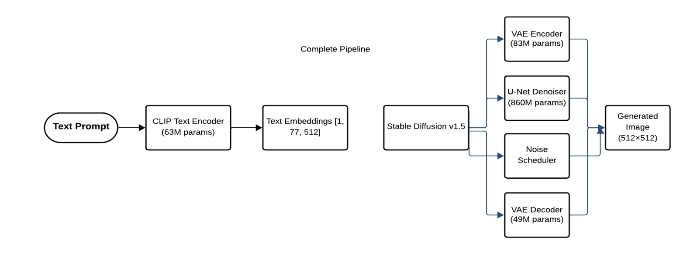
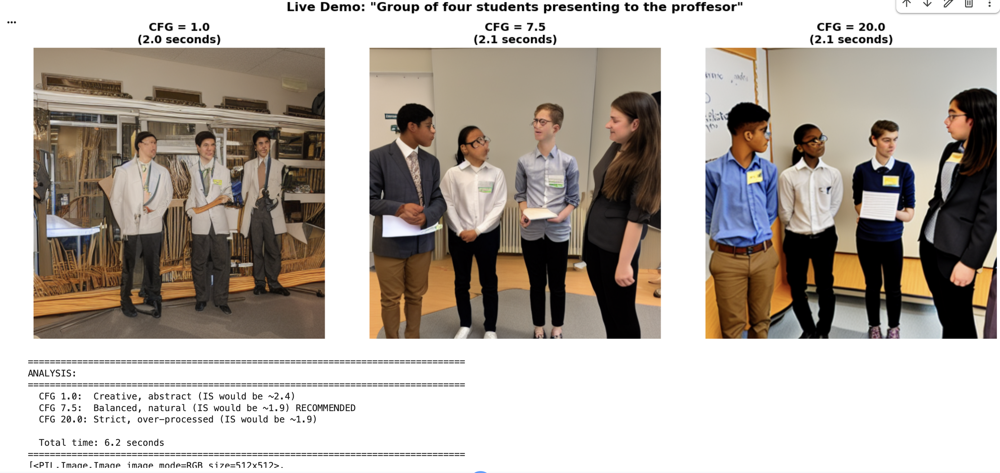

# NNDL_Generative_Project

### Text-to-Image Generation


## Table of Contents
- [Overview](#overview)
- [Team](#team)
- [Features](#features)
- [Architecture](#architecture)
- [Installation](#installation)
- [Dataset](#dataset)
- [Usage](#usage)
- [Experiments](#experiments)
- [Results](#results)
- [Key Findings](#key-findings)
- [Project Structure](#project-structure)
- [Ethical Considerations](#ethical-considerations)
- [Acknowledgments](#acknowledgments)
- [References](#references)

## Overview

This project implements a comprehensive text-to-image generation pipeline using **Stable Diffusion v1.5** and **CLIP** (Contrastive Language-Image Pre-training). We conduct systematic experiments to understand the impact of various hyperparameters on generation quality, providing evidence-based recommendations for practitioners.

### Drive Link for results - https://drive.google.com/drive/folders/1Aja7IT0uFa-BSBUpUNr0WieIo0baUaKj?usp=sharing

### Research Goals
- Systematically evaluate **7 classifier-free guidance (CFG) scales** across diverse prompts
- Compare **4 widely-adopted noise schedulers** under controlled conditions
- Establish quantitative benchmarks using **Inception Score (IS)** and **Fréchet Inception Distance (FID)**
- Provide practical parameter selection guidelines for different use cases

## Team

**Group 7**
- **Parth Saraykar** - saraykar.p@northeastern.edu
- **Novia Dsilva** - dsilva.no@northeastern.edu
- **Sanika Chaudhari** - chaudhari.sani@northeastern.edu
- **Sailee Chaudhari** - choudhari.sai@northeastern.edu

*College of Engineering, Northeastern University, Boston, MA*

## Features

### Core Capabilities
- Multi-scale CFG Testing: Evaluate 7 guidance scales (1.0, 3.0, 5.0, 7.5, 10.0, 15.0, 20.0)
- Scheduler Comparison: Test DDIM, PNDM, Euler Discrete, and DPM++ Multistep
- CLIP Integration: Leverage CLIP ViT-B/32 and ViT-L/14 text encoders
- Comprehensive Logging: Track all experiments with parameters and observations
- Quantitative Evaluation: Calculate IS and FID metrics automatically
- Reproducible Results: Fixed random seeds for experiment reproducibility

### Image Generation
- High-Resolution Output: 512×512 pixel images
- Diverse Categories: Animals, landscapes, urban scenes, abstract art, and more
- Batch Processing: Generate multiple variations per prompt
- Organized Storage: Systematic file structure for all outputs

## Architecture



### Technical Stack
- **Text Encoder**: CLIP ViT-B/32 (512 dimensions, 77 tokens)
- **Diffusion Model**: Stable Diffusion v1.5 (latent diffusion, U-Net architecture)
- **VAE**: 8× compression/decompression
- **Schedulers**: DDIM, PNDM, Euler Discrete, DPM++ Multistep
- **Framework**: PyTorch 2.9.0, Diffusers 0.35.2, Transformers 4.57.2

## Installation

### Prerequisites
- Python 3.12+
- CUDA-capable GPU (recommended: 16GB+ VRAM)
- Google Colab (free tier supported) or local environment

### Setup Instructions

1. **Clone the repository**
```bash
git clone https://github.com/yourusername/generative-project.git
cd generative-project
```

2. **Install dependencies**
```bash
pip install torch torchvision torchaudio
pip install diffusers transformers accelerate
pip install pillow matplotlib numpy
pip install pycocotools scipy scikit-image
pip install clean-fid tqdm
```

3. **HuggingFace Authentication**
- Create account at [huggingface.co](https://huggingface.co)
- Generate access token: Settings → Access Tokens
- Accept Stable Diffusion license agreement

4. **Mount Google Drive** (if using Colab)
```python
from google.colab import drive
drive.mount('/content/drive')
```

## Dataset

### COCO val2017
- **Size**: 5,000 images with human-annotated captions
- **Categories**: 80 object classes (animals, vehicles, furniture, etc.)
- **Resolution**: Resized to 512×512 pixels
- **Download**: Automatic via provided scripts

**Dataset Statistics**:
- Total images: 5,000
- Multiple captions per image
- Diverse semantic coverage
- Normalized to [-1, 1] range

## Usage

### How It Works - Live Demo

Our system demonstrates real-time text-to-image generation with different CFG scales. Here's a practical example from our classroom presentation:



*Figure: Live demonstration showing the impact of CFG scaling on the same prompt. Generated three variations of "Group of four students presenting in front of professor" at different guidance scales.*

**Demo Results:**
- **CFG = 1.0** (2.0s generation time): Creative, abstract interpretation - high diversity but loose prompt adherence
- **CFG = 7.5** (2.1s generation time): Balanced, natural result - optimal quality and prompt alignment (RECOMMENDED)
- **CFG = 20.0** (2.1s generation time): Strict, over-processed - literal interpretation with artificial appearance

**Analysis:**
```
CFG 1.0:  Creative, abstract (IS would be ~2.4)
CFG 7.5:  Balanced, natural (IS would be ~1.9) RECOMMENDED
CFG 20.0: Strict, over-processed (IS would be ~1.9)

Total generation time: ~6.2 seconds for all three variations
```

This live example perfectly illustrates our key finding: **CFG 7.5 provides the optimal balance** between creative interpretation and accurate prompt following.

### Quick Start

```python
# Import libraries
from diffusers import StableDiffusionPipeline
import torch

# Load pipeline
pipe = StableDiffusionPipeline.from_pretrained(
    "runwayml/stable-diffusion-v1-5",
    torch_dtype=torch.float16
)
pipe = pipe.to("cuda")

# Generate image
prompt = "a golden retriever puppy playing in a sunny garden"
image = pipe(
    prompt=prompt,
    num_inference_steps=50,
    guidance_scale=7.5
).images[0]

# Save result
image.save("output.png")
```

### Running Full Experiments

**Option 1: Google Colab**
1. Open `NNDL_Generative_Project.ipynb` in Colab
2. Run all cells sequentially
3. Results saved to Google Drive

**Option 2: Local Execution**
```bash
jupyter notebook NNDL_Generative_Project.ipynb
```

### Running Specific Experiments

**CFG Scale Sweep**:
```python
cfg_scales = [1.0, 3.0, 5.0, 7.5, 10.0, 15.0, 20.0]
for scale in cfg_scales:
    image = pipe(prompt, guidance_scale=scale).images[0]
    image.save(f"cfg_{scale}.png")
```

**Scheduler Comparison**:
```python
from diffusers import DDIMScheduler, EulerDiscreteScheduler

pipe.scheduler = DDIMScheduler.from_config(pipe.scheduler.config)
image = pipe(prompt).images[0]
```

## Experiments

### Experiment Design

#### 1. Classifier-Free Guidance (CFG) Tuning
- **Parameters Tested**: 7 scales (1.0, 3.0, 5.0, 7.5, 10.0, 15.0, 20.0)
- **Test Prompts**: 8 diverse categories
- **Seeds per Scale**: 5 (42-46)
- **Total Images**: 280

#### 2. Noise Scheduler Comparison
- **Schedulers**: DDIM, PNDM, Euler Discrete, DPM++ Multistep
- **Test Prompts**: 8 (same as CFG experiments)
- **Seeds per Scheduler**: 5
- **Total Images**: 160

#### 3. Text Encoder Evaluation
- **Models**: CLIP ViT-B/32 vs. ViT-L/14
- **Baseline Prompts**: 5 test cases
- **Total Images**: 60

### Test Prompts
1. "A golden retriever puppy playing in a sunny garden"
2. "A futuristic city skyline at night with neon lights"
3. "A bowl of fresh strawberries on a wooden table"
4. "An astronaut floating in space near Earth"
5. "A peaceful mountain lake with reflection at sunset"
6. "A vintage red car parked on a cobblestone street"
7. "A colorful abstract painting with geometric shapes"
8. "A cozy library with books and warm lighting"

## Results

### Quantitative Metrics

#### CFG Scale Impact
| CFG Scale | Inception Score | FID Score | Observations |
|-----------|----------------|-----------|--------------|
| 1.0 | 2.417 ± 0.558 | 240.03 | High diversity, poor alignment |
| 3.0 | 1.881 ± 0.561 | 139.77 | Artistic, creative |
| 5.0 | 1.816 ± 0.540 | 69.69 | Balanced |
| **7.5** | **1.932 ± 0.591** | **ref** | **Optimal (baseline)** |
| **10.0** | **1.886 ± 0.505** | **61.11** | **Best FID** |
| 15.0 | 1.858 ± 0.466 | 101.39 | Over-saturated |
| 20.0 | 1.941 ± 0.577 | 132.37 | Artificial appearance |

#### Scheduler Performance
| Scheduler | Inception Score | FID Score | Speed |
|-----------|----------------|-----------|-------|
| DDIM | 1.800 ± 0.431 | 161.07 | Baseline |
| **PNDM** | **1.932 ± 0.591** | **153.52** | Moderate |
| Euler | 1.820 ± 0.482 | 165.57 | Fast |
| DPM++ | 1.810 ± 0.494 | 169.11 | **Fastest** |

### Visual Results

Results demonstrate clear progression from creative/abstract (low CFG) to hyper-literal (high CFG). See full visualizations in `milestone2_outputs/` directory.

## Key Findings

### 1. Optimal CFG Range: 7.5–10.0
- Best balance between prompt adherence and naturalness
- CFG=7.5: Default recommendation for general use
- CFG=10.0: Lowest FID (61.11), best semantic alignment

### 2. Scheduler Choice: Minimal Impact
- Quality variation <7% across all schedulers
- **Recommendation**: Prioritize speed over marginal quality gains
- **DPM++ Multistep**: Best speed-quality trade-off (25-40% faster)

### 3. Parameter Trade-offs
- Low CFG (1.0-3.0): High creativity, poor prompt following
- Medium CFG (5.0-10.0): Optimal balance
- High CFG (15.0-20.0): Literal but artificial appearance

### 4. Use-Case Recommendations
| Application | Recommended CFG | Steps | Scheduler |
|-------------|----------------|-------|-----------|
| General Purpose | 7.5 | 40-50 | DPM++ |
| Artistic/Creative | 3.0-5.0 | 50 | PNDM |
| Precise Control | 10.0-12.0 | 50 | DDIM |
| Fast Inference | 7.5 | 30 | Euler/DPM++ |

## Project Structure

```
generative-project/
├── NNDL_Generative_Project.ipynb    # Main notebook
├── README.md                         # This file
├── requirements.txt                  # Dependencies
│
├── coco_data/                        # Dataset
│   ├── val2017/                     # Images
│   └── annotations/                 # Captions
│
├── generated_images/                 # Milestone 1 outputs
│   ├── test_1.png
│   ├── test_2.png
│   └── ...
│
├── milestone2_outputs/               # Milestone 2 results
│   ├── baseline/                    # 8 baseline images
│   ├── cfg_sweep/                   # 280 CFG images
│   ├── schedulers/                  # 160 scheduler images
│   ├── observations_summary.txt     # Findings
│   └── SUBMISSION_SUMMARY.txt       # Overview
│
├── milestone2_logs/                  # Experiment logs
│   ├── training_log.json            # Full log
│   └── experiment_summary.json      # Statistics
│
└── evaluation/                       # Metrics & analysis
    ├── metrics/
    ├── plots/
    └── tables/
```

## Ethical Considerations

### Dataset Bias
- COCO exhibits demographic and geographic biases
- Underrepresentation of certain groups may lead to lower quality generation
- Future work should include fairness-aware evaluation protocols

### Potential Misuse
- **Deepfakes**: Risk of generating misleading synthetic media
- **Copyright**: Models may reproduce copyrighted artistic styles
- **Harmful Content**: Adversarial prompting could bypass safety filters

### Responsible Development
- Safety filtering and content moderation
- Provenance tracking (watermarking/metadata)
- Transparent documentation of limitations
- Stakeholder engagement in deployment decisions

### Regulatory Compliance
Consider EU AI Act requirements for high-risk applications including conformity assessments and ongoing monitoring.

## Acknowledgments

We thank:
- **Professor Xuemin Jin** at Northeastern University for guidance and support

## References

1. Ho et al. (2020). "Denoising Diffusion Probabilistic Models." NeurIPS.
2. Rombach et al. (2022). "High-Resolution Image Synthesis with Latent Diffusion Models." CVPR.
3. Nichol et al. (2022). "GLIDE: Towards Photorealistic Image Generation." ICML.
4. Saharia et al. (2022). "Photorealistic Text-to-Image Diffusion Models." NeurIPS.
5. Ramesh et al. (2022). "Hierarchical Text-Conditional Image Generation with CLIP Latents." arXiv.

---


